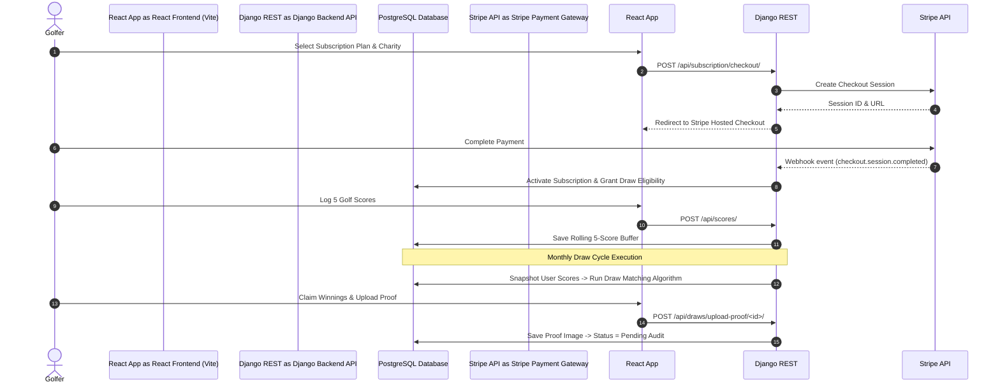

# ⛳ Digital Heroes - Enterprise Golf Sweepstake & Philanthropic Subscription Platform

[](https://www.djangoproject.com/)
[](https://react.dev/)
[](https://vitejs.dev/)
[](https://stripe.com/)
[](https://www.postgresql.org/)
[]()

**Digital Heroes** is an enterprise-grade full-stack platform designed to combine amateur golf score tracking, recurring subscription billing, charity donation distribution, and automated sweepstake/prize draws. Golfers log their authentic handicap/Stableford scores, support non-profit organizations of their choice, and automatically participate in recurring monthly prize draws.

---

## 📌 Table of Contents

- [Executive Summary](#-executive-summary)
- [System Architecture](#-system-architecture)
- [Key Features](#-key-features)
- [Technology Stack](#-technology-stack)
- [Database Schema & Data Models](#-database-schema--data-models)
- [API Specifications & Endpoint Reference](#-api-specifications--endpoint-reference)
- [Environment Configuration](#-environment-configuration)
- [Local Development Setup](#-local-development-setup)
- [Stripe Integration & Webhooks](#-stripe-integration--webhooks)
- [Production Deployment Strategy](#-production-deployment-strategy)
- [Testing & Quality Assurance](#-testing--quality-assurance)
- [Project Directory Structure](#-project-directory-structure)
- [License & Support](#-license--support)

---

## 💡 Executive Summary

Digital Heroes solves a dual challenge in community sports: engaging amateur golfers with competitive sweepstakes while channeling subscription revenues into verified philanthropic charities. 

### How It Works:
1. **Subscription Onboarding**: Users sign up and select a subscription plan (Monthly or Yearly) processed securely via **Stripe Checkout**.
2. **Charity Allocation**: A configurable percentage (minimum 10%) of each subscription directly benefits a user's selected non-profit charity.
3. **Score Entry**: Golfers enter their latest 5 official golf scores (valid range: 1–45). The system maintains a rolling 5-score history.
4. **Automated Monthly Draws**: At the end of each billing cycle, administrators execute a Draw. The platform matches each subscriber's score snapshot against drawn numbers.
5. **Prize Distribution & Audit**: Matching tiers (5-match Jackpot, 4-match pool, 3-match pool) award prize funds. Winners submit scorecard verification screenshots, which are audited via the Admin Backoffice before payout distribution.

---

## 🏗️ System Architecture



---

## ✨ Key Features

### 🏌️‍♂️ Golfer Experience
- **Rolling Score Engine**: Validates and stores exactly 5 active scores per player, automatically pruning older entries upon submission.
- **Philanthropic Dashboard**: View individual donation impact, total charity pool contributions, and charity profiles.
- **Live Draw & Entries Feed**: View active draw jackpots, historical draw results, and personal matched score cards.
- **Winnings Audit Hub**: Secure file upload system for submitting scorecard proof screenshots with claim tracking (`Pending`, `Approved`, `Paid`).

### 💳 Financial & Subscription Engine
- **Stripe Billing Integration**: Native Stripe Checkout Sessions, subscription cancellation workflows, and real-time status synchronization.
- **Revenue Split Engine**: Automatically calculates charity contributions, prize pool allocations, and platform fees.
- **Stripe Webhook Resilience**: Handlers for `checkout.session.completed`, `customer.subscription.updated`, and `customer.subscription.deleted` events.

### 🛡️ Backoffice & Administrative Suite
- **Analytics Dashboard**: Real-time tracking of Monthly Recurring Revenue (MRR), total active subscribers, total prize money distributed, and charity donations.
- **Draw Management Hub**: Interactive draw runner allowing draw simulation, manual/random draw number generation, rollover handling, and draw publication.
- **Winner Verification Audit**: Dedicated interface for superusers to review scorecard screenshots, approve/reject claims, add admin notes, and mark payments as completed.
- **Charity Content Management**: Onboard new non-profit partners, update logos/banners, manage upcoming events, and toggle featured status.

---

## 🛠️ Technology Stack

### Frontend
| Component | Technology | Rationale |
| :--- | :--- | :--- |
| **Framework** | React 19 + Vite 8 | Ultra-fast build times, HMR, and modern JSX features |
| **Routing** | React Router v7 | Declarative nested routing & auth protection guards |
| **State Management** | Zustand | Lightweight, unopinionated client state management |
| **Data Fetching** | TanStack React Query v5 | Automatic caching, revalidation, and optimistic updates |
| **Form Handling** | React Hook Form + Zod | Schema-validated form submissions with zero re-render overhead |
| **Styling & UI** | Vanilla CSS Design System + Framer Motion | Customized micro-interactions, responsive design, and animations |
| **HTTP Client** | Axios | Configured with automatic JWT request authorization interceptors |

### Backend
| Component | Technology | Rationale |
| :--- | :--- | :--- |
| **Framework** | Python 3.11+ / Django 5.x / DRF | Enterprise-grade ORM, security defaults, and REST APIs |
| **Authentication** | `djangorestframework-simplejwt` | Token-based stateless authentication with token blacklisting |
| **Database** | PostgreSQL | Robust transactional data model for financial & draw data |
| **Billing** | Stripe Python SDK v15 | Secure subscription billing and webhook signature parsing |
| **File Storage** | WhiteNoise / AWS S3 | Static asset compression and cloud media storage |
| **Production Server** | Gunicorn | High-performance WSGI HTTP server |

---

## 🗄️ Database Schema & Data Models

```
 +------------------+       +-------------------+       +-------------------+
 |       User       |       |      Charity      |       |     GolfScore     |
 +------------------+       +-------------------+       +-------------------+
 | id (PK)          |------>| id (PK)           |       | id (PK)           |
 | email (Unique)   |       | name              |       | user_id (FK)      |---> User
 | is_subscriber    |       | slug (Unique)     |       | score (1..45)     |
 | selected_charity |       | is_featured       |       | date_played       |
 +------------------+       +-------------------+       +-------------------+
          |
          |                 +-------------------+       +-------------------+
          |                 |       Draw        |       |     DrawEntry     |
          |                 +-------------------+       +-------------------+
          +---------------->| id (PK)           |------>| id (PK)           |
          |                 | month / year      |       | draw_id (FK)      |
          |                 | status            |       | user_id (FK)      |
          |                 | drawn_numbers     |       | scores_snapshot   |
          |                 | jackpot_amount    |       | match_count       |
          |                 +-------------------+       +-------------------+
          |                                                       |
          +-------------------------------------------------------+
                                  |
                        +-------------------+
                        |      Winner       |
                        +-------------------+
                        | id (PK)           |
                        | draw_id (FK)      |
                        | user_id (FK)      |
                        | match_type        |
                        | prize_amount      |
                        | proof_screenshot  |
                        | verification_status|
                        | payment_status    |
                        +-------------------+
```

---

## 🔌 API Specifications & Endpoint Reference

### Authentication & Profile (`/api/auth/`, `/api/user/`)
- `POST /api/auth/register/` — User account registration.
- `POST /api/auth/login/` — Authenticate and obtain JWT access & refresh tokens.
- `POST /api/auth/logout/` — Blacklist refresh token and invalidate session.
- `GET|PUT /api/user/profile/` — Fetch or update logged-in user profile.
- `POST /api/user/select-charity/` — Update user's designated charity partner.

### Golf Scores (`/api/scores/`)
- `GET /api/scores/` — List user's 5 rolling golf scores.
- `POST /api/scores/` — Add a new score (1–45 range enforced; automatically purges 6th oldest score).
- `PUT|DELETE /api/scores/<id>/` — Modify or delete an individual score record.

### Charities (`/api/charities/`)
- `GET /api/charities/` — Retrieve list of active philanthropic charities.
- `GET /api/charities/<slug>/` — Retrieve detailed charity profile & event roster.

### Subscriptions & Stripe (`/api/subscription/`)
- `GET /api/subscription/plans/` — Fetch active subscription pricing tiers.
- `POST /api/subscription/checkout/` — Initialize Stripe Checkout Session.
- `POST /api/subscription/confirm/` — Confirm completed Stripe payment.
- `POST /api/subscription/webhook/` — Stripe Webhook listener endpoint.
- `POST /api/subscription/cancel/` — Cancel active recurring subscription.
- `GET /api/subscription/status/` — Retrieve current user subscription status.

### Draws & Winnings (`/api/draws/`)
- `GET /api/draws/current/` — Get active draw status, countdown, and jackpot amount.
- `GET /api/draws/history/` — Browse historical draw archives and winning numbers.
- `GET /api/draws/my-entries/` — View user's past draw entries and score snapshots.
- `GET /api/draws/my-winnings/` — View won prizes and payout statuses.
- `POST /api/draws/upload-proof/<id>/` — Upload handicap verification screenshot for winner validation.

### Admin Backoffice (`/api/admin/`) *(Superuser Restricted)*
- `GET /api/admin/analytics/` — Aggregate platform KPIs (MRR, Subscribers, Payouts, Donations).
- `GET|POST /api/admin/draws/` — List or create draw instances.
- `POST /api/admin/draws/<id>/run/` — Simulate/calculate draw matches against subscriber score snapshots.
- `POST /api/admin/draws/<id>/publish/` — Publish finalized draw results.
- `GET /api/admin/winners/` — Review pending winner verification claims.
- `POST /api/admin/winners/<id>/verify/` — Approve or reject winner proof screenshot.
- `POST /api/admin/winners/<id>/mark-paid/` — Update winner payout status to `Paid`.
- `GET|POST|PUT|DELETE /api/admin/charities/` — Full CRUD management of charity partners.
- `GET /api/admin/users/` — Inspect user account details, subscriptions, and scores.

---

## ⚙️ Environment Configuration

### Backend `.env` (`backend/.env`)
```env
# General Django Config
SECRET_KEY=your_production_secret_key_here
DEBUG=False
ALLOWED_HOSTS=localhost,127.0.0.1,api.yourdomain.com
CORS_ALLOWED_ORIGINS=http://localhost:5173,https://yourdomain.com

# Database Connection (PostgreSQL / Supabase)
DB_NAME=digital_heroes_db
DB_USER=postgres
DB_PASSWORD=your_secure_db_password
DB_HOST=localhost
DB_PORT=5432
DB_SSLMODE=require

# Stripe Gateway Credentials
STRIPE_SECRET_KEY=sk_test_...
STRIPE_WEBHOOK_SECRET=whsec_...
STRIPE_PRICE_ID_MONTHLY=price_...
STRIPE_PRICE_ID_YEARLY=price_...
FRONTEND_URL=http://localhost:5173
```

### Frontend `.env` (`frontend/digital_heroes/.env`)
```env
VITE_API_URL=http://localhost:8000/api
VITE_STRIPE_PUBLISHABLE_KEY=pk_test_...
```

---

## 🚀 Local Development Setup

### Prerequisites
- **Python**: v3.11 or higher
- **Node.js**: v20.x or higher
- **Package Managers**: `pip`, `npm`
- **Database**: PostgreSQL (or fallback SQLite for local quickstart)
- **Stripe CLI**: (Optional, for local webhook testing)

---

### Step 1: Clone the Repository
```bash
git clone https://github.com/your-org/digital-heroes.git
cd digital-heroes/Golf
```

---

### Step 2: Backend Setup
```bash
# Navigate to backend directory
cd backend

# Create virtual environment
python -m venv venv

# Activate virtual environment
# Windows (PowerShell):
.\venv\Scripts\Activate.ps1
# macOS/Linux:
source venv/bin/activate

# Install dependencies
pip install -r requirements.txt

# Run database migrations
python manage.py migrate

# Seed sample database data (Charities, Subscription Plans)
python manage.py seed_data

# Create superuser account for admin access
python manage.py createsuperuser

# Start Django development server
python manage.py runserver 0.0.0.0:8000
```
Backend API will now be running at: **`http://localhost:8000/`**

---

### Step 3: Frontend Setup
```bash
# Navigate to frontend application directory
cd ../frontend/digital_heroes

# Install NPM packages
npm install

# Start Vite development server
npm run dev
```
Frontend Web Application will now be running at: **`http://localhost:5173/`**

---

## 💳 Stripe Integration & Webhooks

To test subscription payment flows and webhooks locally:

1. Download and authenticate the [Stripe CLI](https://stripe.com/docs/stripe-cli).
2. Start forwarding Stripe webhook events to your local API:
   ```bash
   stripe listen --forward-to localhost:8000/api/subscription/webhook/
   ```
3. Copy the outputted Webhook Signing Secret (`whsec_...`) into `backend/.env` as `STRIPE_WEBHOOK_SECRET`.
4. Run the Stripe price sync command to map subscription products:
   ```bash
   python manage.py update_stripe_plans
   ```

---

## 🚢 Production Deployment Strategy

### Backend (Render / Heroku / AWS Elastic Beanstalk)
The backend includes a pre-configured `build.sh` script and `Procfile` for one-click deployment:

```bash
# build.sh execution flow during deployment:
pip install -r requirements.txt
python manage.py collectstatic --no-input
python manage.py migrate
python manage.py update_stripe_plans
```

**Production Web Process (`Procfile`)**:
```procfile
web: gunicorn mysite.wsgi:application
```

### Frontend (Vercel / Netlify)
The frontend is optimized for static SPA hosting with `vercel.json` rewrite configuration:
- **Build Command**: `npm run build`
- **Output Directory**: `dist`
- **Environment Variables**: Configure `VITE_API_URL` and `VITE_STRIPE_PUBLISHABLE_KEY` in deployment settings.

---

## 🧪 Testing & Quality Assurance

### Backend Tests
Execute Django unit and integration tests:
```bash
cd backend
python manage.py test
```

### Frontend Linting
Run ESLint rules across the codebase:
```bash
cd frontend/digital_heroes
npm run lint
```

---

## 📁 Project Directory Structure

```
Golf/
├── backend/
│   ├── api/
│   │   ├── management/commands/  # Seed data & Stripe synchronization scripts
│   │   ├── migrations/           # Django database migration files
│   │   ├── admin.py              # Django Admin interface registrations
│   │   ├── draw_views.py         # Draw simulation, publish & winner audit APIs
│   │   ├── models.py             # User, Charity, Draw, Winner & Plan ORM models
│   │   ├── serializers.py        # DRF Data serializers and validation
│   │   ├── stripe_views.py       # Stripe Checkout, Billing & Webhook views
│   │   ├── urls.py               # API Routing registry
│   │   └── views.py              # Authentication, Profile & Charity views
│   ├── mysite/                   # Core Django project settings & WSGI configuration
│   ├── Procfile                  # Production process supervisor command
│   ├── build.sh                  # Automated CI/CD deployment script
│   ├── manage.py                 # Django management tool
│   └── requirements.txt          # Python dependency specifications
│
└── frontend/digital_heroes/
    ├── public/                   # Public static branding assets
    ├── src/
    │   ├── api/                  # Axios HTTP client configuration & endpoint services
    │   ├── components/           # Reusable UI components (Navbar, Modals, Cards, Footers)
    │   ├── hooks/                # Custom React hooks
    │   ├── pages/
    │   │   ├── admin/            # Backoffice pages (Draws, Winners, Charities, Users)
    │   │   ├── auth/             # Login & Registration pages
    │   │   ├── dashboard/        # Golfer portal (Scores, Entries, Winnings, Settings)
    │   │   └── public/           # Landing page, How It Works, Charities, Pricing
    │   ├── store/                # Zustand client state stores (Auth, Draw, Subscription)
    │   ├── App.jsx               # Application route provider & layout shell
    │   └── main.jsx              # React application entrypoint
    ├── eslint.config.js          # ESLint code quality configuration
    ├── package.json              # Frontend NPM package manifest
    ├── vercel.json               # Vercel SPA routing configuration
    └── vite.config.js            # Vite build configuration
```

---

## 📄 License & Support

This project is proprietary software. All rights reserved.

For technical inquiries, system architecture questions, or deployment assistance, please contact the development team or file an issue in the project repository.
